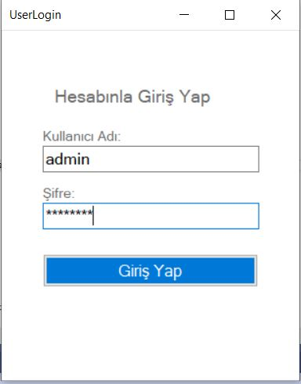
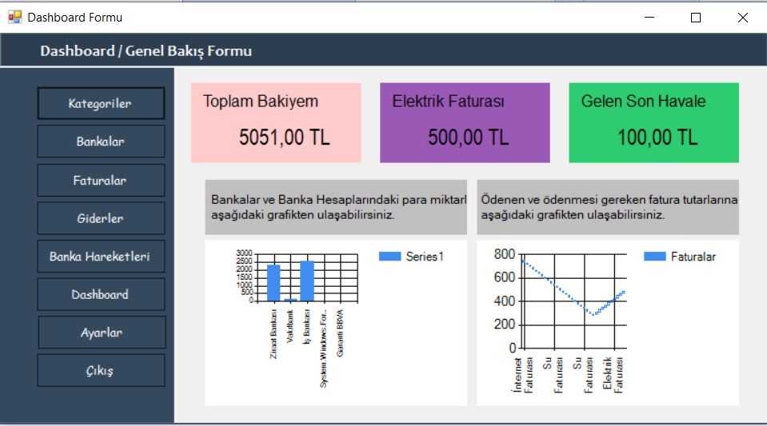

# FinancialCrm
Bu projemiz C# Form Application ile yazılmış. Entity Framework Teknolojisinden faydalanılmıştır. Yazılırken Veri tabanı olarak Sql Server Kullanılmış. DbFirst mantıgı ile veritabanı oluşturulmuştur.

Form ilk açıldıgında bizi bir Kullanıcı Giriş Sayfası Karşılamakta ve giriş yanlışsa sisteme girmeye izin vermemektedir.

Sisteme Giriş Dogru ise ;
Bizi Dashboard Sayfasına atmakta. 
<b>Dashboard Sayfasında bizi;</b>
<ul>
  <li>Toplam Bakiye</li>
  <li>Fatura Giderleri</li>
  <li>Gelen Son Havale</li>
  <li>Faturalarla ve Bankalarla ilgili Grafikler</li>
</ul>
karşılamakta.

