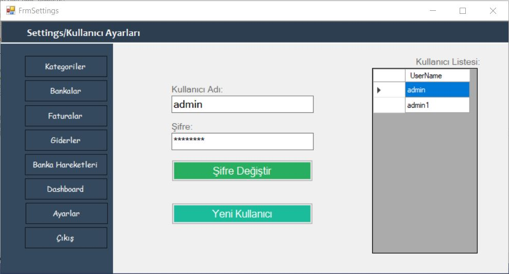
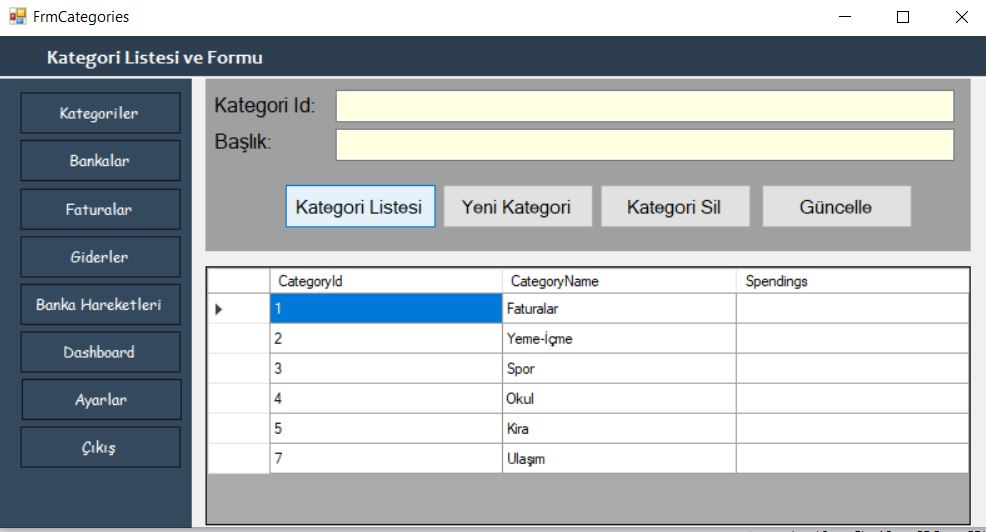
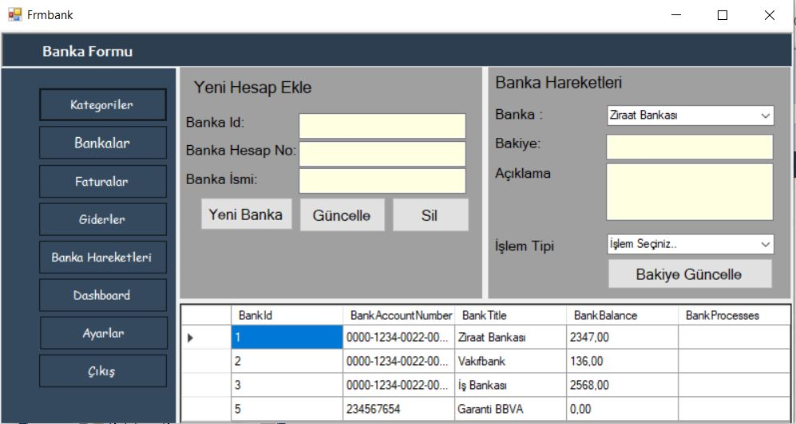

# FinancialCrm
Bu projemiz C# Form Application ile yazılmış. Entity Framework Teknolojisinden faydalanılmıştır. Yazılırken Veri tabanı olarak Sql Server Kullanılmış. DbFirst mantıgı ile veritabanı oluşturulmuştur.

Form ilk açıldıgında bizi bir Kullanıcı Giriş Sayfası Karşılamakta ve giriş yanlışsa sisteme girmeye izin vermemektedir.

 
Sisteme Giriş Dogru ise ;
 
Bizi Dashboard Sayfasına atmakta. 
  
<b>Dashboard Sayfasında bizi;</b>
 
<ul>
  <li>Toplam Bakiye</li>
  <li>Fatura Giderleri</li>
  <li>Gelen Son Havale</li>
  <li>Faturalarla ve Bankalarla ilgili Grafikler</li>
</ul>
karşılamakta.

  
<b>Ayarlar Sayfasında bizi;</b>
 Kullanıcı ve Şifre Değiştirme ve Kullanıcı Listesi Karşılamakta.

  
<b>Kategoriler Sayfasında bizi;</b>
<ul>
  <li>Kategori Listesi</li>
  <li>Yeni Kategori Ekleme</li>
  <li>Kategori Güncelleme</li>
  <li>Kategori Silme</li>
</ul>
 gibi işlemler karşılamakta.

  
<b>Bankalar Sayfasında bizi;</b>
<ul>
  <li>Yeni Hesap Ekleme</li>
  <li>Hesap Güncelleme</li>
  <li>Hesap Silme</li>
  <li>Banka ve işlem tipine göre Hesap Hareketi Ekleme</li>
</ul>
 gibi işlemler karşılamakta.

Bankalar formu açılırken "Banka Hareketleri" kısmındaki Banka kısmı veritabanından otomatik çekilmektedir.
İşlem Tipi "Gelen havale" ise veritabanında Bank Process Tablosuna hesap hareketi olarak veri eklenmekte. Ayrıca Seçili bankaya göre o hesaba para girişi olmaktadır.
İşlem Tipi "Giden havale" ise veritabanında Bank Process Tablosuna hesap hareketi olarak veri eklenmekte. Ayrıca Seçili bankaya göre o hesabtan para gideri olmaktadır. 

